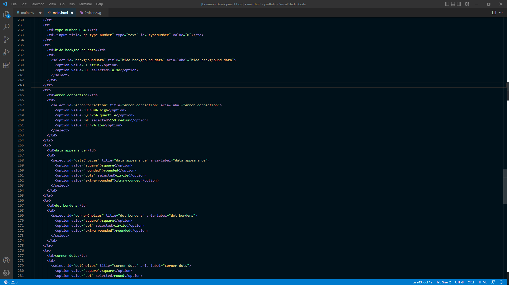
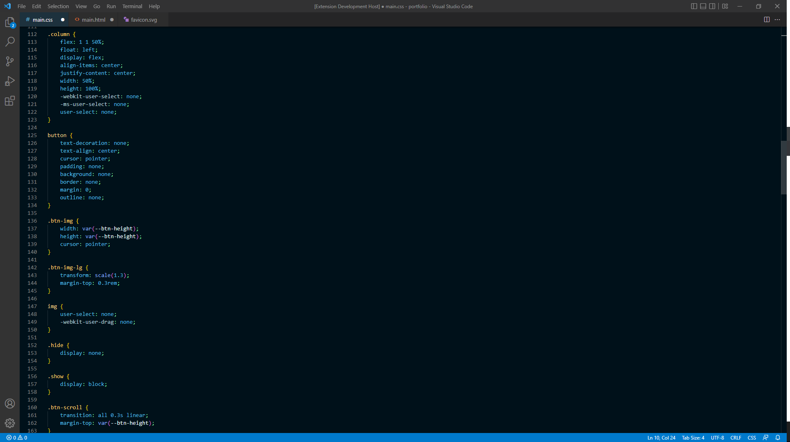
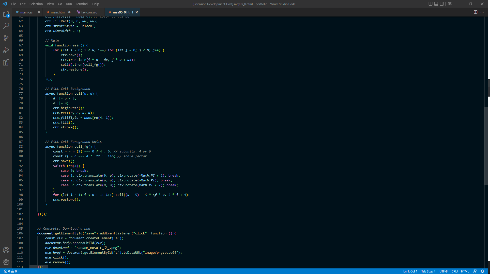
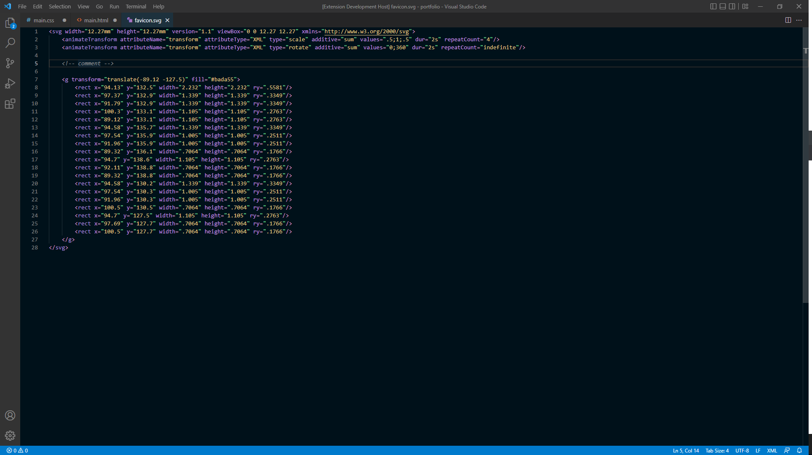

# Lunar New Year (설날)

## Screenshots

<figure>
<figcaption>HTML</figcaption>

</figure>
<figure>
<figcaption>CSS</figcaption>

</figure>
<figure>
<figcaption>JS</figcaption>

</figure>
<figure>
<figcaption>SVG</figcaption>

</figure>

## Installation
1. Open the ***Extensions*** sidebar panel from within the Visual Studio Code editor window.

2. Search for **'Lunar New Year'** in the extension marketplace.

3. Click the **Install** button.

3. Once installed, enable the theme from the ***Color Theme*** drop down list:

    > File > Preferences > Color Theme > Lunar New Year

## Authors

Matt Lorber | mlorber.dev@outlook.com

## License
Creative Commons Attribution 4.0 International License https://creativecommons.org/licenses/by/4.0/

